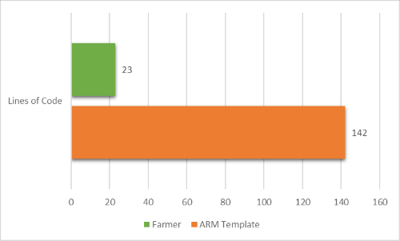



### Making repeatable Azure deployments easy!

Farmer is a DSL for rapidly generating non-complex ARM templates in a type-safe manner.

### Main Features
* **Create ARM templates quickly and easily** through a simple, strongly-typed and pragmatic DSL.
* **Completely backwards compatible with ARM templates**. Farmer generates standard ARM templates so you can continue to use existing deployment processes.
* **Runs on .NET Core**.
* **Safely create dependencies between resources**. Uses static typing to give confidence that your templates will work first time.
* **Easily access common properties of resources**. No more fighting to concatinate cryptic strings!
* **Extensible API**. Add new helpers and members as needed.
* **Open source and free**. Farmer is free to use. We welcome contributions to the project!

Farmer uses a simple DSL to declare resources and comes with helper functions to perform common tasks. Farmer templates are **around 5-8 times smaller than ARM templates**, meaning they are quicker and easier to author, understand and maintain.



##### Creating a web application with a configured application insights and a linked storage account

### Farmer Templates

These **23 lines of simple, readable and type-safe code** are translated into **142 lines of JSON ARM template!**

```fsharp
// Create a storage account with a container
let myStorageAccount = storageAccount {
    name "myTestStorage"
    add_public_container "myContainer"
}

// Create a web app with application insights that's connected to the storage account.
let myWebApp = webApp {
    name "myTestWebApp"
    setting "storageKey" myStorageAccount.Key
    always_on
    depends_on myStorageAccount.Name
}

// Create an ARM template
let deployment = arm {
    location NorthEurope
    add_resource myStorageAccount
    add_resource myWebApp
}

// Deploy it to Azure!
deployment
|> Writer.quickDeploy "myResourceGroup"
```

#### Want to try it out? Follow our [quickstart guide](quickstarts/quickstart-1) now!
